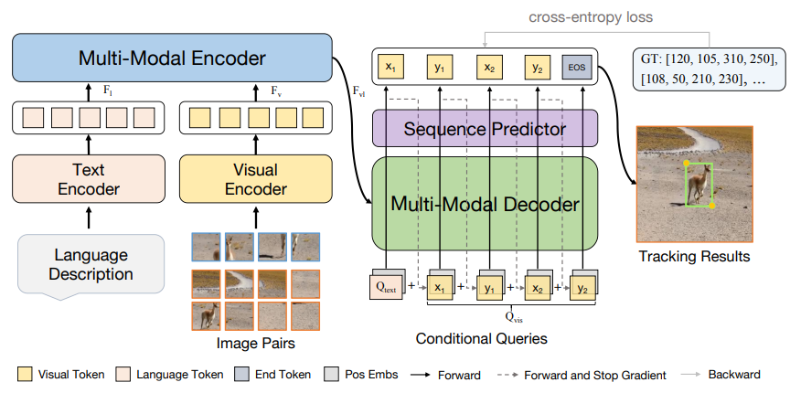

# Towards Unified Token Learning for Vision-Language Tracking (MMTrack)

The official implementation for the **TCSVT 2023** paper [[_Towards Unified Token Learning for Vision-Language Tracking_](https://arxiv.org/abs/2308.14103)].

[[Models](https://drive.google.com/drive/folders/1TJdQB7WRfePG0-FR2yH-ldO684Ir5LSl?usp=sharing)]
[[Raw Results](https://drive.google.com/drive/folders/14kCYrdcBebtORg4Pqw73goWUYDkJiSwL?usp=sharing)]


<p align="center">
  
</p>


## :sunny: Highlights

### Performance

| Tracker     | TNL2K (AUC) | LaSOT (AUC) | LaSOT-ext (AUC) | OTB99-Lang (AUC) |
|:-----------:|:------------:|:-----------:|:-----------------:|:-----------:|
| VLT_{TT} | 54.7         | 67.3        | 48.4              | 74.0        |
| JointNLT | 56.9         | 60.4        | -              | 65.3        |
| MMTrack  | 58.6         | 70.0        | 49.4              | 70.5        |


## Install the environment
```
conda create -n mmtrack python=3.8
conda activate mmtrack
bash install.sh
```


## Set project paths
Run the following command to set paths for this project
```
python tracking/create_default_local_file.py --workspace_dir . --data_dir ./data --save_dir ./output
```
After running this command, you can also modify paths by editing these two files
```
lib/train/admin/local.py  # paths about training
lib/test/evaluation/local.py  # paths about testing
```

## Data Preparation
Put the tracking datasets in ./data. It should look like:
   ```
   ${PROJECT_ROOT}
    -- data
        -- lasot
            |-- airplane
            |-- basketball
            |-- bear
            ...
        -- tnl2k
            |-- test
            |-- train
        -- refcoco
            |-- images
            |-- refcoco
            |-- refcoco+
            |-- refcocog
        -- otb_lang
            |-- OTB_query_test
            |-- OTB_query_train
            |-- OTB_videos
   ```


## Training

Dowmload the pretrained [OSTrack](https://drive.google.com/drive/folders/1XJ70dYB6muatZ1LPQGEhyvouX-sU_wnu) and [Roberta-base](https://huggingface.co/roberta-base/tree/main), and put it under `$PROJECT_ROOT$/pretrained_networks`.

```
python tracking/train.py \
--script mmtrack --config baseline --save_dir ./output \
--mode multiple --nproc_per_node 2 --use_wandb 0
```

Replace `--config` with the desired model config under `experiments/mmtrack`. 
If you want to use [wandb](https://github.com/wandb/client) to record detailed training logs, you can set `--use_wandb 1`.


## Evaluation
Download the model weights from [Google Drive](https://drive.google.com/drive/folders/1c0n1CbexyLTJWnrqs_vB6WLiyG3yXWke?usp=sharing) 

Put the downloaded weights on `$PROJECT_ROOT$/output/checkpoints/train/mmtrack/baseline`

Change the corresponding values of `lib/test/evaluation/local.py` to the actual benchmark saving paths

Some testing examples:
- LaSOT_lang or other off-line evaluated benchmarks (modify `--dataset` correspondingly)
```
python tracking/test.py --tracker_name mmtrack --tracker_param baseline --dataset_name lasot_lang --threads 8 --num_gpus 2

python tracking/analysis_results.py # need to modify tracker configs and names
```

- lasot_extension_subset_lang
```
python tracking/test.py --tracker_name mmtrack --tracker_param baseline --dataset_name lasot_extension_subset_lang --threads 8 --num_gpus 2
```

- TNL2k_Lang
```
python tracking/test.py --tracker_name mmtrack --tracker_param baseline --dataset_name tnl2k_lang --threads 8 --num_gpus 2
```

- OTB_Lang
```
python tracking/test.py --tracker_name mmtrack --tracker_param baseline --dataset_name otb_lang --threads 8 --num_gpus 2
```


## Acknowledgments
* Thanks for the [OSTrack](https://github.com/botaoye/OSTrack) and [Stable-Pix2Seq](https://github.com/gaopengcuhk/Stable-Pix2Seq) library, which helps us to quickly implement our ideas.


## Citation
If our work is useful for your research, please consider cite:

```
@ARTICLE{Zheng2023mmtrack,
  author={Zheng, Yaozong and Zhong, Bineng and Liang, Qihua and Li, Guorong and Ji, Rongrong and Li, Xianxian},
  journal={IEEE Transactions on Circuits and Systems for Video Technology}, 
  title={Towards Unified Token Learning for Vision-Language Tracking}, 
  year={2023},
}
```
